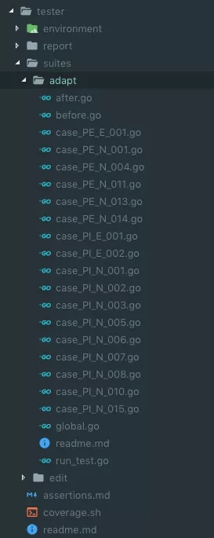

# Test

测试金字塔分为 4 个层次，最下面是单元测试，单元测试对代码进行测试。再而上是集成测试，它对一个服务的接口进行测
试。继而是端到端（e2e）的测试，它负责从一个入口输入测试用例，验证输出的系统的结果。再上一层
是最常用的 UI 测试，就是测试人员在 UI 界面上根据功能进行点击测试。

## 单元测试
一般单元测试，最直接的衡量标准就是代码覆盖率。单元测试一般测试的对象是一个函数，一个类。

## 集成测试

对于一个服务，会提供多个接口，那么，测试这些接口的表现就是集成测试最重要的目标了。

集成测试和单元测试不一样，它不属于某个文件，集成测试可能涉及到多个文件中多个接口的测试，所以它需要有一个单独的文件夹。目录结构：

- `suites` 存放测试套件
- `suites/xxx` 存放测试套件，测试套件文件夹需要包含下列文件：
  - `before.go` 包含
    - `SetUp()` 函数，这个函数在 Suite 运行之前会运行
    - `Before()` 函数，这个函数在所有 Case 运行之前运行
  - `after.go` 包含
    - `TearDown()` 函数，这个函数在 Suite 运行之后会运行
    - `After()` 函数，这个函数在 Suite 运行之后运行
  - `run_test.go` testsuite 的入口
- `environment` 初始化测试环境的工具，可以存放初始化环境的配置文件和 db 的建表文件等等
- `report` 生成的测试报告

Web 服务测试的环境是个很大问题。特别是 DB 依赖，可以使用 model mock，也可以使用测试 db 。

## 端到端测试

这个测试需要保证的是整个链路流转是按照预期的。
